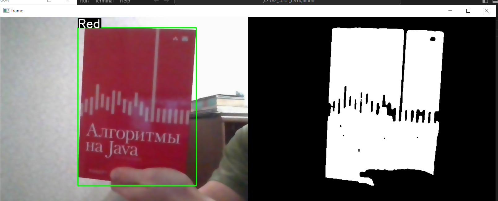

A simple openCV application that can detect object of red, blue and green color based on HSV color model.
In the code there are given predefined values for color ranges, but one can uncomment the respective line to change color range interactively with Trackbars.

The default values could be unprecize as they depend on particular light conditions.

